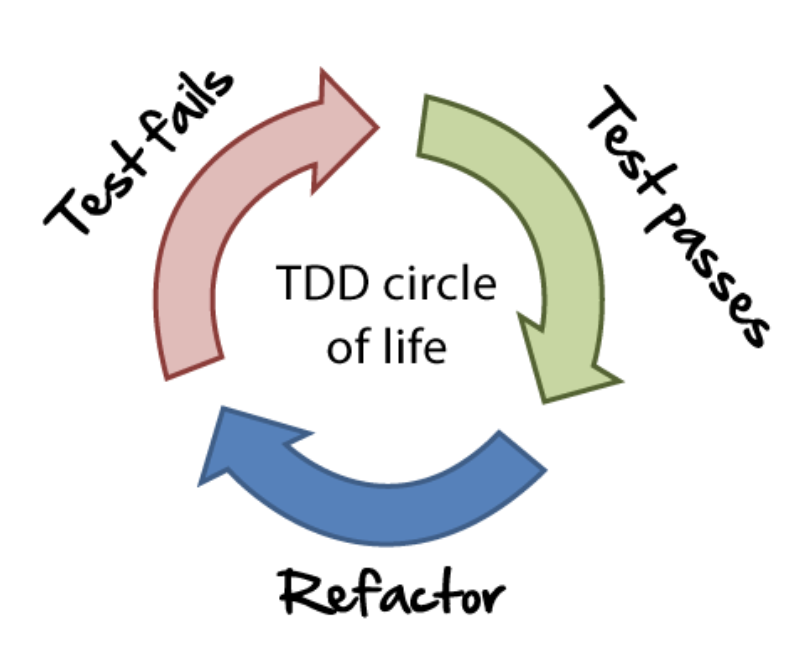

# FizzBuzz Kata

## La loi d'or du _Test Driven Development (TDD)_

Vous ne pouvez pas écrire de code de production sans d'abord exécuter un test qui échoue.

## Les 3 phases du _cycle TDD_

* Phase rouge : Écrire un test qui échoue.
* Phase verte : Écrire juste assez de code pour passer le test.
* Refactor : Améliorer le code en conservant les tests au vert.

## Consigne du Kata :

👋 Bienvenue à FizzBuzz.

🖋️ Écrivez un programme qui satisfait les exigences suivantes :

* Remplacez tout entier divisible par 3 par "Fizz".
* Remplacez tout entier divisible par 5 par "Buzz".
* Remplacez tout entier divisible par 3 et 5 par "FizzBuzz".
* (Bonus) Utilisez l'IA pour simuler les edge cases 

### Suggestion ###

Nous avons déjà commencé par écrire un test qui échoue (phase rouge du cycle TDD). 
À vous de continuer.
